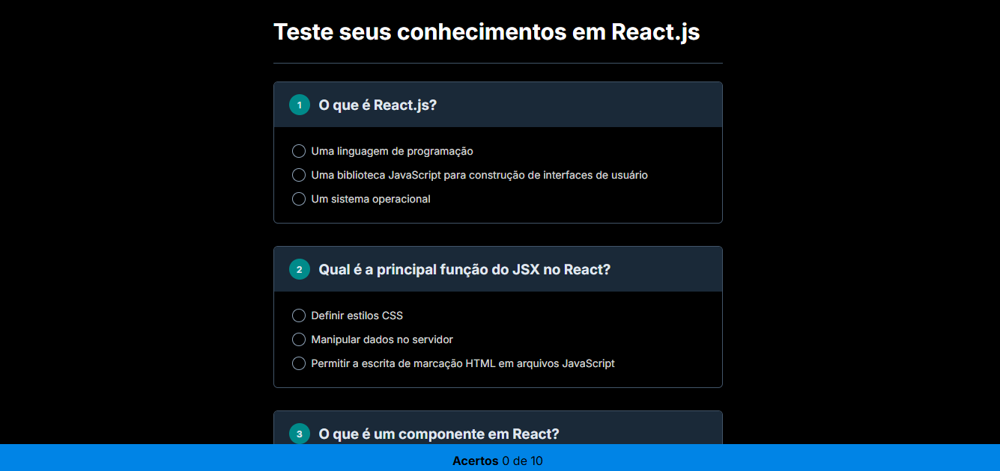

# 🎮 Quiz React.js: Teste seus Conhecimentos! 🚀

E aí, galera! Bem-vindos ao meu projeto de quiz sobre React.js! 🤓 Se você acha que manja tudo de hooks, componentes e JSX, essa é a hora de provar! 💥

## 🧐 Sobre o Projeto

Este é um quiz simples, mas divertido, criado para testar seus conhecimentos em React.js. A ideia é responder a uma série de perguntas e ver quantos acertos você consegue. 🏆

## 🛠️ Tecnologias Utilizadas

* **HTML:** A base da nossa página, onde a mágica acontece.
* **CSS:** Para deixar tudo bonitão e com aquela vibe dark que a gente adora. 🖤
* **JavaScript:** O cérebro do quiz, que faz as perguntas aparecerem e calcula seus acertos. 🧠

## 🚀 Como Executar

1.  Abra o arquivo `index.html` no seu navegador favorito.

2.  Responda às perguntas e veja sua pontuação no final!
